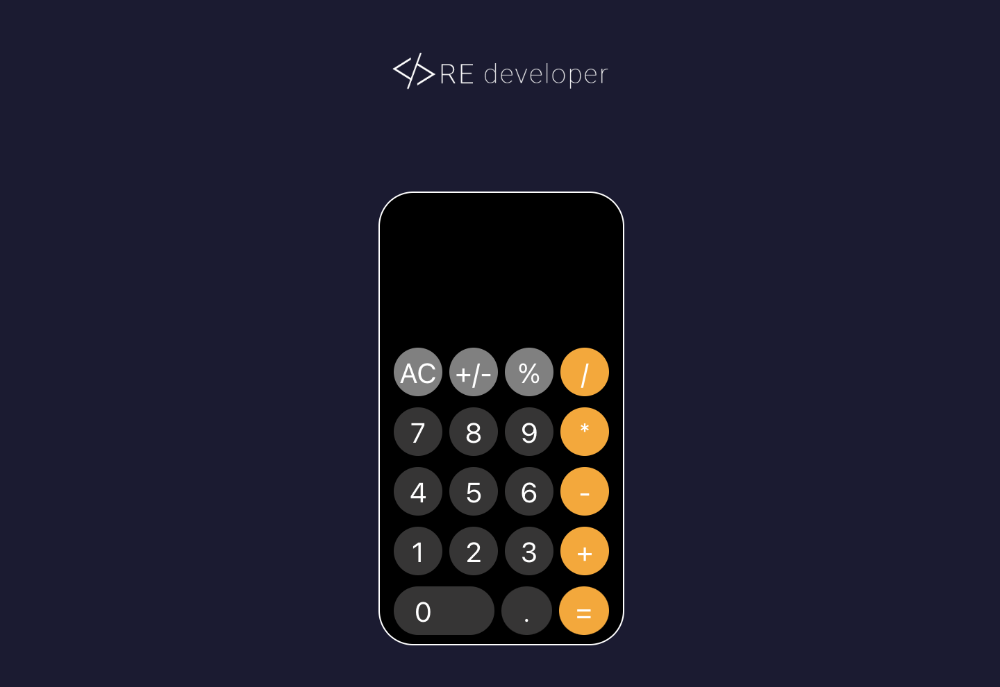

# 👆 📱 IPhone Calculator Clone

## Screenshots



📱 A precise replica of the iPhone calculator app, meticulously crafted using HTML, CSS, and JavaScript. Experience the familiar design and seamless functionality of the iPhone calculator right in your browser. Perfect for those who appreciate simplicity and elegance in their digital tools.🚀


## Technologies Used


## Getting Started

These instructions will help you get a copy of the project up and running on your local machine for development and testing purposes. 

### Prerequisites

Make sure you have the following installed on your machine:

- [Node.js](https://nodejs.org/)
- [npm](https://www.npmjs.com/) (Node Package Manager)

### Installation

1. Clone the repository to your local machine:

    ```bash
    git clone https://github.com/your-username/project-name.git
    ```

2. Navigate to the project directory:

    ```bash
    cd JavaScript
    ```

3. Install dependencies:

    ```bash
    npm install
    ```

### Running the Application

To start the development server and view the project in your browser, run:

```bash
npm start
```


## Project Structure
```bash
src/
|-- components/
|   |-- Button.jsx
|   |-- Screen.jsx
|-- styles/
|   |-- Button.css
|   |-- Screen.css
|-- App.css
|-- App.js
|-- index.css
|-- index.js
```
## Contact


[Ricardo Estrada]

## 🔗 Links
[](https://github.com/Frontgrammer98/Frontgrammer98)
[](https://www.linkedin.com/in/ricardo-estrada-b433b71a7/)


