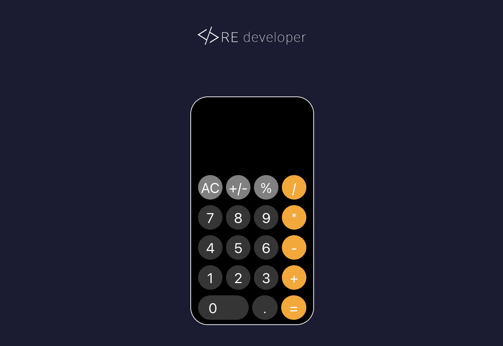

# 👆 📱 IPhone Calculator Clone

## Screenshots



📱 A precise replica of the iPhone calculator app, meticulously crafted using HTML, CSS, and JavaScript. Experience the familiar design and seamless functionality of the iPhone calculator right in your browser. Perfect for those who appreciate simplicity and elegance in their digital tools.🚀


## Technologies Used


## Getting Started

These instructions will help you get a copy of the project up and running on your local machine for development and testing purposes. 

## Installation


Ensure you have Node.js and npm installed on your machine. Then, clone the repository and run:

```bash
npm install
```

## Run Locally

Clone the project

```bash
  git clone https://github.com/Frontgrammer98/Click-Counter.git
```

Go to the project directory

```bash
  cd TypeScript
```

Install dependencies

```bash
  npm install
```

Start the server

```bash
  npm run dev

  o + Enter
```


## Project Structure
```bash
src/
|-- components/
|   |-- Logo.tsx
|   |-- Counter.tsx
|-- styles/
|   |-- Logo.css
|   |-- Counter.css
|-- App.css
|-- App.tsx
|-- index.css
|-- main.tsx
|-- vite-env.d.ts
```
## Contact


[Ricardo Estrada]

## 🔗 Links
[](https://github.com/Frontgrammer98/Frontgrammer98)
[](https://www.linkedin.com/in/ricardo-estrada-b433b71a7/)
